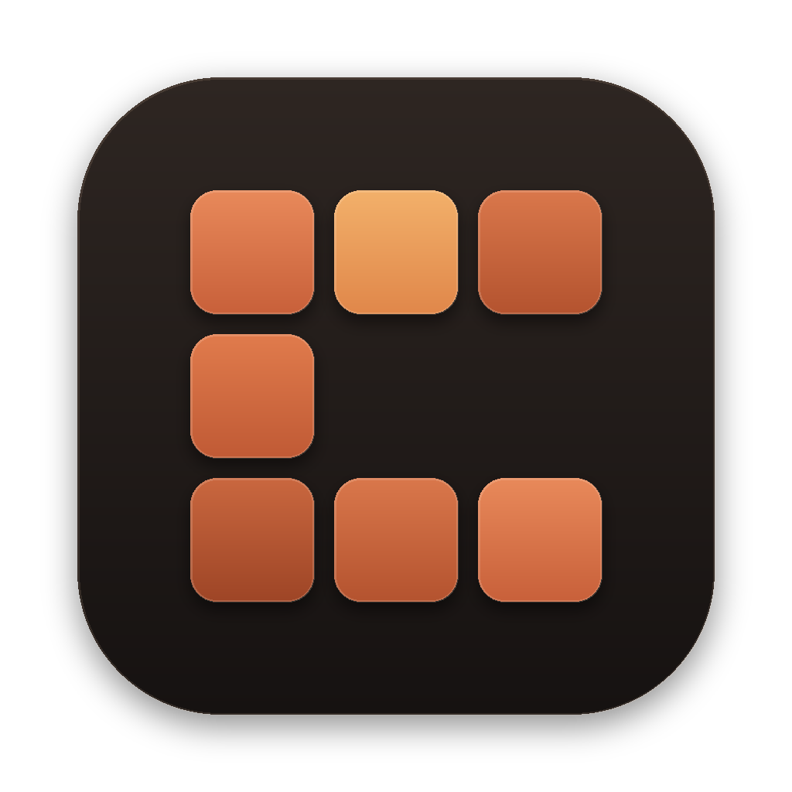
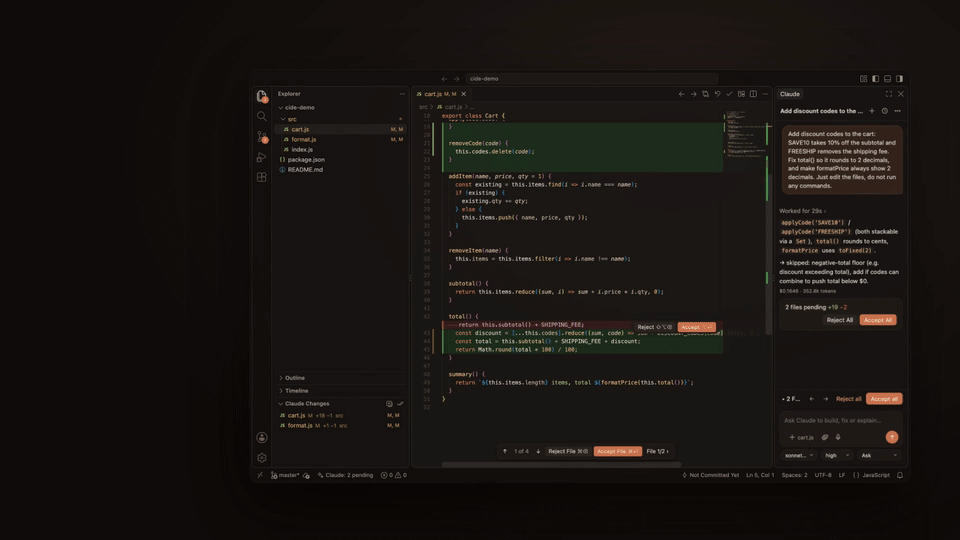
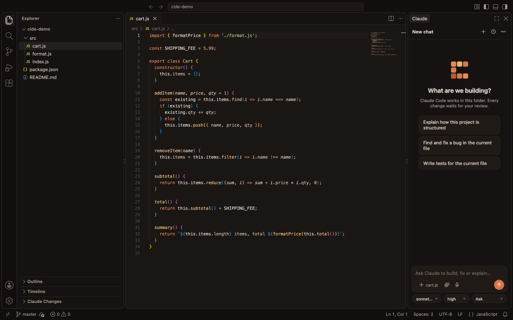
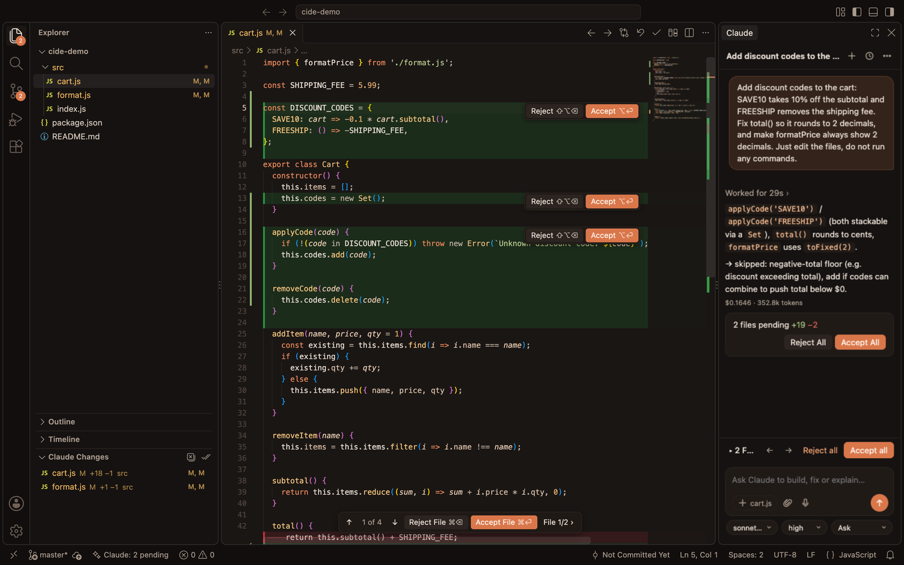
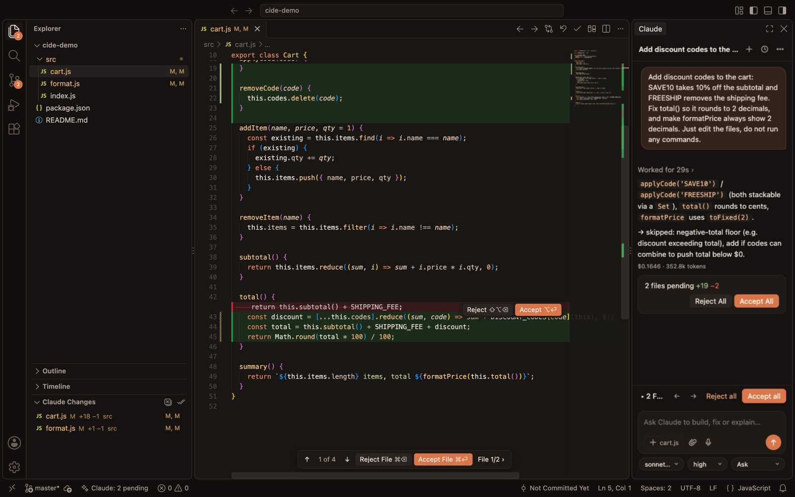
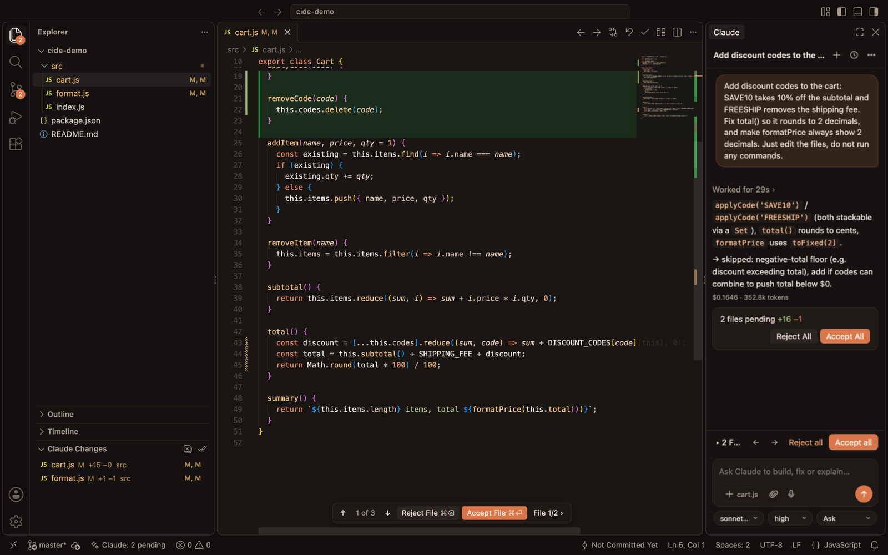
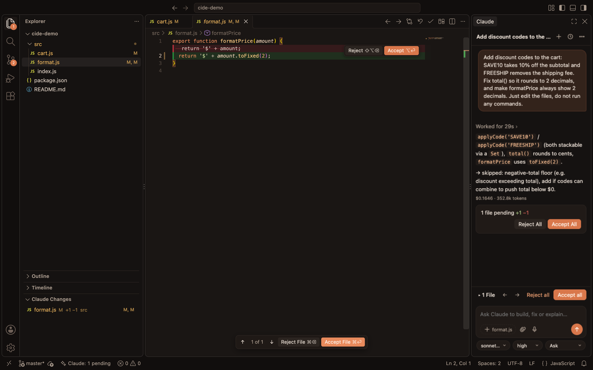
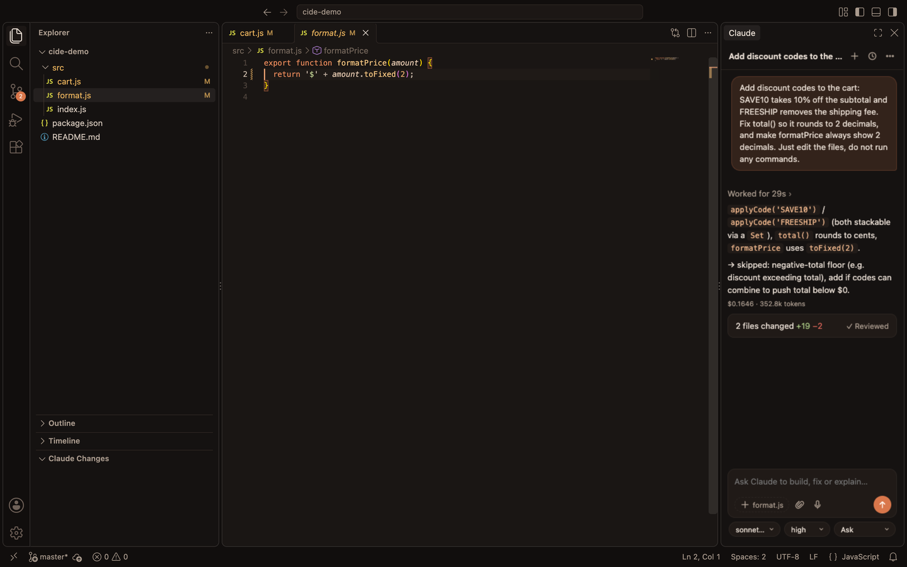
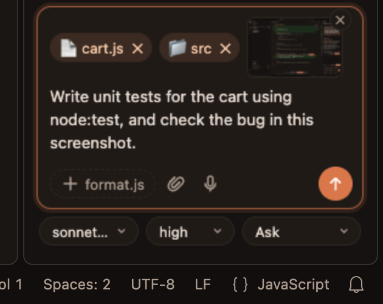
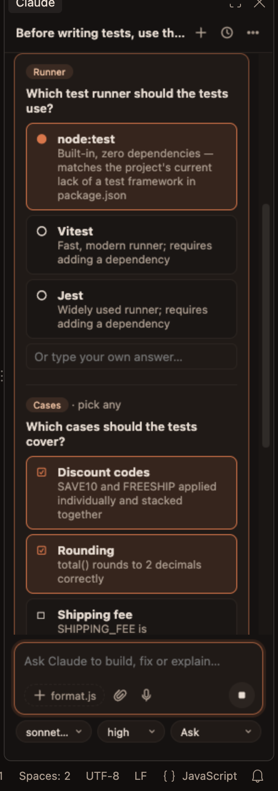

<p align="center">
  
</p>

<h1 align="center">Claude IDE</h1>

<p align="center">
  <b>Preview, accept and reject Claude Code file changes inline.</b><br>
  A VS Code (Code - OSS) fork with the real Claude Code agent built in, where every change Claude makes waits for your review.<br>
  <a href="https://error404sushant.github.io/claude-ide/">Website</a> · <a href="https://github.com/error404sushant/claude-ide/releases/latest">Download for macOS</a> · Created by <a href="https://github.com/error404sushant">error404sushant</a>
</p>

<p align="center">
  <br>
  <sub>🔊 <a href="https://github.com/error404sushant/claude-ide/raw/main/docs/claude-ide-demo.mp4">Download the demo video with sound (MP4, 21 s)</a></sub>
</p>

---

## What it is

Claude IDE is my own editor: a fork of Code - OSS (the open-source core of VS Code) with a Claude panel on the right that runs the **real Claude Code agent** through the Claude Agent SDK. It uses the same agent loop, tools, `CLAUDE.md` files, settings, hooks and MCP servers as the `claude` CLI, and the same session history, so conversations started in the terminal show up here and vice versa.

What makes it different is **how you review what Claude writes**. Claude works freely; every file it touches (including files changed by shell commands) lands in a review stack. You see the old code in red right inside the file, and you accept or reject each change, each file, or everything at once. Nothing is final until you say so.

<p align="center"></p>

## Why not just use the Claude Code VS Code extension?

The official [Claude Code extension](https://code.claude.com/docs/en/vs-code) is great, and Claude IDE runs the same agent. The difference is the editor around it:

| | Claude Code extension | Claude IDE |
|---|---|---|
| **Reviewing edits** | *Manual* mode pauses on each edit and shows a side-by-side diff before it's written; *Auto / Edit automatically* applies edits without review | Claude keeps working; all its edits collect in a **review stack** you go through afterwards, Cursor-style |
| **Where you review** | A separate diff view per proposed edit | **Inside the real file**: removed lines in red above the new code, per-change **Accept / Reject** buttons, a floating bar (`1 of 4 · Reject File · Accept File · Next file`) |
| **Scope of review** | The edit being proposed | Every file Claude changed across the whole turn, including files changed by **shell commands** (`sed -i`, codegen, formatters) |
| **Undo** | Reject the proposed edit; checkpoints to rewind | Reject restores **byte-identical** originals (new files are deleted); per-change undo; **Restore to here** on any message |
| **Attaching files** | Hold **Shift** while dragging; paste images | Just **drag** files, folders or screenshots onto the chat; paste images too |
| **Voice** | – | 🎤 Offline dictation (ffmpeg + whisper.cpp), nothing leaves your machine |
| **The editor itself** | Your VS Code | A dedicated app: warm *Claude IDE Dark* theme, Claude panel on the right by default, no Copilot sign-in prompts, Open VSX extensions |

## A JavaScript change, start to finish

**1. Ask.** Open a project, type what you want. Here: *"Add discount codes to the cart: SAVE10 takes 10% off and FREESHIP removes the shipping fee. Fix total() so it rounds to 2 decimals, and make formatPrice always show 2 decimals."*



**2. Review inline.** Claude edits `cart.js` and `format.js`. New code is green, and each change has **Reject / Accept**. The floating bar shows where you are (`1 of 4`) and jumps between changes and files. The **Claude Changes** list on the left and the chat card on the right show everything that's pending.



**3. See exactly what was replaced.** Removed lines stay visible in red, struck through, directly above their replacement: here the old `return this.subtotal() + SHIPPING_FEE;` versus the new rounding logic.



**4. Accept (or reject) change by change.** After accepting the `total()` change the counter drops to `1 of 3`. **Accept File** (`⌘⏎`) finishes the file and jumps to the next one: `format.js`, with its own inline diff.

| After accepting one change | Next file opens automatically |
|---|---|
|  |  |

**5. Done.** When everything is accepted the chat card switches to **✓ Reviewed**. Rejecting instead restores the original bytes exactly.



## More features

**Drag anything into the chat.** Files and folders from the Explorer, editor tabs, or screenshots from Finder: drop them on the panel and they become attachment chips (images are sent to Claude as images). No Shift key, no typing paths. You can also paste screenshots with `⌘V`.

<p align="center"></p>

**Claude asks, you choose.** When Claude needs a decision it shows a question card: single or multiple choice, with a field for your own answer on every question.

<p align="center"></p>

**Everything else**
- **Four permission modes:** *Auto* (apply now, undo per file), *Ask* (stage everything for review), *Ask each edit* (approve before writing), *Plan* (read-only until you approve the plan)
- **Past conversations** for the open folder, searchable, resumable, shared with the `claude` CLI
- **Model + effort pickers**, cost and token count per turn, Stop at any time
- **Current-file chip:** one click to include the open file and your selection
- **Keyboard:** `⌘⏎` accept file · `⌘⌫` reject file · `⌥⏎` accept change · `⇧⌥⌫` reject change · `⌥]` / `⌥[` next/previous change · `⌘⇧⏎` accept all
- **Restricted Mode aware:** untrusted folders show a *Trust folder* prompt instead of running the agent

## Download

Get the latest **Claude IDE** from [**Releases**](https://github.com/error404sushant/claude-ide/releases/latest):

| File | For |
|---|---|
| `Claude-IDE-…-macOS-arm64.dmg` | macOS on Apple silicon (M1 or later): open it and drag **Claude IDE** into **Applications** |
| `Claude-IDE-…-macOS-arm64.zip` | Same app as a zip |
| `claude-agent-….vsix` | Just the extension, for VS Code, Cursor, Antigravity or any VS Code-based editor |

**Before first launch:**
1. Install [Claude Code](https://code.claude.com/docs/en/setup) and sign in once in a terminal: run `claude`, then `/login`. Claude IDE uses that login; you can also use an API key via *Claude: Set API Key*. On Windows use the native installer (it puts `claude.exe` in `%USERPROFILE%\\.local\\bin`).
2. The app is ad-hoc signed, not notarized by Apple, so macOS blocks the first launch. Either right-click **Claude IDE** in Applications → **Open** → **Open**, or run:
   ```sh
   xattr -dr com.apple.quarantine "/Applications/Claude IDE.app"
   ```

**Voice input (optional):** `brew install ffmpeg whisper-cpp` and put a model at `~/.claude-ide/whisper/ggml-base.en.bin` ([download](https://huggingface.co/ggerganov/whisper.cpp)).

## Build from source

The same scripts build on macOS and Windows. The first run downloads the exact VS Code (Code - OSS 1.140.0) source these patches were written for, installs dependencies and builds, which takes roughly 20 to 40 minutes and about 12 GB of disk.

**macOS (Apple silicon)**: Xcode Command Line Tools (`xcode-select --install`), Node 24 (`brew install node@24`), Python 3, Git.

```sh
git clone https://github.com/error404sushant/claude-ide.git
cd claude-ide
./build-app.sh                         # → VSCode-darwin-arm64/Claude IDE.app + DMG/ZIP in release/
```

**Windows (x64 or ARM64)**: Visual Studio 2022 with *Desktop development with C++*, Node 24, Python 3, Git (`git config --global core.longpaths true`).

```powershell
git clone https://github.com/error404sushant/claude-ide.git
cd claude-ide
node scripts/build.mjs --package        # → VSCode-win32-x64\ + Claude-IDE-…-Windows-x64-Setup.exe in release\
```

Windows builds also run automatically on GitHub (**Actions → Build Windows**), including a launch test, so you don't need a Windows PC to produce the installer.

`scripts/build.mjs` runs `scripts/apply-fork.mjs` (branding, icons, default layout and theme, the review UI and drop handling in `fork-patches/`, and the built-in extension), builds with gulp, removes the unused Copilot components, and packages the app. `scripts/smoke-test.mjs` launches the result and checks that the Claude panel loads.

**Only the extension:**

```sh
cd claude-agent
npm install
npm run package                        # → claude-agent.vsix
code --install-extension claude-agent.vsix
```

In stock VS Code the review UI uses CodeLens and decorations. The full inline experience (red removed lines, floating review bar, drop-anywhere) needs the Claude IDE app.

## How it works

```
claude-agent/                  the extension (runs in any VS Code-based editor)
  src/extension.ts             agent session via @anthropic-ai/claude-agent-sdk, permissions, chat panel, history, attachments
  src/review.ts                review stack: snapshots before each edit, shell-command change detection, checkpoints,
                               Changes tree, decorations, commands, persistence across reloads
  src/hunks.ts                 per-change (hunk) accept / reject, byte-exact
  src/voice.ts                 offline dictation (ffmpeg + whisper.cpp)
  media/                       chat panel UI
  themes/claude-ide-dark.json  the Claude IDE Dark theme
fork-patches/
  claudeReview.contribution.ts inline review UI in the editor core (removed-line zones, per-change buttons, floating bar)
                               and the chat drop handler
  brand/                       icon + watermark generator
scripts/                       build.mjs (macOS/Windows/Linux), apply-fork.mjs (patches), smoke-test.mjs (launch test)
apply-fork.sh / build-app.sh   macOS shortcuts for the scripts above
.github/workflows/             builds the Windows installers on GitHub
docs/                          screenshots, demo video and its source
```

Before Claude edits a file, a `PreToolUse` hook records the original. The edit then happens for real, so Claude always sees a consistent disk. The review UI compares the original with the current file, and *Accept* / *Reject* either keep the new content or write the original back, per change or per file. Shell commands are handled the same way by diffing a workspace snapshot taken before and after each command.

## Tests

```sh
cd claude-agent
npm test        # per-change accept/reject logic
npm run e2e     # launches VS Code and drives the real agent through 16 end-to-end checks
```

The end-to-end suite covers staging edits, shell-command changes (`sed -i`), Reject All restoring byte-identical files, per-change accept/reject, persistence across reload, history and resume, Auto mode undo, checkpoints, Stop mid-turn, *Ask each edit*, Plan mode approval, and multiple-choice questions. It runs through a symlinked workspace path on purpose.

## Credits

Created by **[error404sushant](https://github.com/error404sushant)**.

Built on [Code - OSS](https://github.com/microsoft/vscode) (MIT) and the [Claude Agent SDK](https://www.npmjs.com/package/@anthropic-ai/claude-agent-sdk). Claude and Claude Code are trademarks of Anthropic; this is an independent project, not affiliated with or endorsed by Anthropic.
